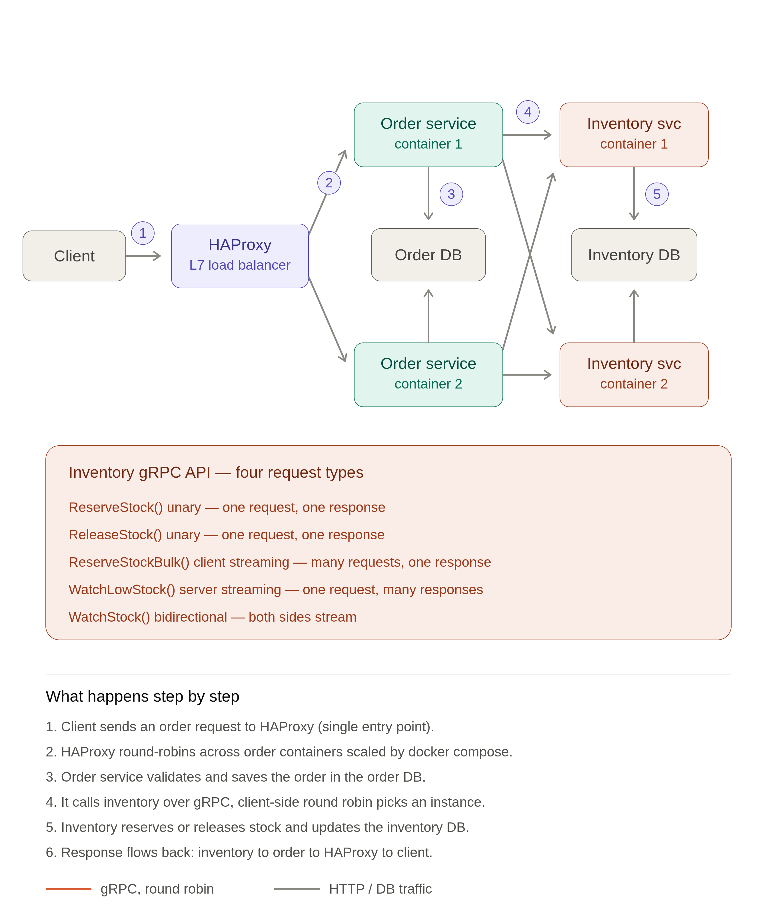

# OrderFlow gRPC

Cross-framework **gRPC** between two backends: a **FastAPI** service (gRPC client,
public REST) and a **Django** service (internal gRPC server). A REST call to
FastAPI fans out to Django over gRPC, and each service owns its own Postgres — the
cross-service link is by reference only, coordinated over gRPC rather than a shared
database.

## What it demonstrates

- **Cross-framework gRPC** — FastAPI (async client) ⇄ Django (async server).
- **Shared `.proto` contract** owned by neither service, generated into both.
- **All four RPC shapes** — unary, client-streaming, server-streaming, bidirectional.
- **Client-side load balancing** — one client, two Django replicas, round-robin.
- **gRPC interceptors** — client-side auth; server-side auth + request logging.
- **Reserve/release saga** — idempotent reserve with a compensating release on
  order-persist failure, so stock is never oversold or stranded.

## Architecture

```
                         ┌──────────────────┐  gRPC (round-robin)  ┌────────────────────┐
  host ── :8000 ──▶ nginx│   order-service   │─────────────────────▶│ inventory-service-1 │
                         │    (FastAPI)      │─────────────────────▶│ inventory-service-2 │
                         │   gRPC client     │                      │   :50051 (internal) │
                         └────────┬─────────┘                      └──────────┬─────────┘
                                  ▼                                           ▼
                            ┌───────────┐                              ┌───────────────┐
                            │ order-db  │                              │ inventory-db  │
                            │ (Postgres)│                              │  (Postgres)   │
                            └───────────┘                              └───────────────┘
```



- **order-service** (FastAPI) — the only host-published entrypoint (`:8000`);
  translates REST/WebSocket into gRPC calls.
- **inventory-service** (Django) — internal gRPC server on `:50051`, run as two
  stateless replicas sharing one `inventory-db`.

See [architecture.md](architecture.md) for the full picture,
[decisions.md](decisions.md) for the rationale.

## RPCs

Defined in [proto/order_inventory.proto](proto/order_inventory.proto) — the
source-of-truth contract.

| RPC | Shape | What it does |
|-----|-------|--------------|
| `ReserveStock` | unary | Atomic, all-or-nothing reserve for one order; idempotent via `idempotency_key` (safe retries, no double-decrement). |
| `ReleaseStock` | unary | Compensating release (saga rollback) that returns quantities to stock; idempotent no-op if nothing is reserved. |
| `ReserveStockBulk` | client-streaming | Stream many orders, best-effort per line; one aggregate summary at the end. |
| `WatchLowStock` | server-streaming | Stream every product at/below a threshold, straight from a DB cursor. |
| `WatchStock` | bidirectional-streaming | Client streams subscribe/unsubscribe commands; server independently streams live stock updates for the watch set. |

## REST / WebSocket API

Public surface exposed by order-service. Interactive docs at
`http://localhost:8000/docs`.

| Endpoint | → RPC | Notes |
|----------|-------|-------|
| `POST /orders` | `ReserveStock` | Reserve then persist; `Idempotency-Key` header makes retries safe. |
| `POST /orders/bulk` | `ReserveStockBulk` | Per-order summary: `persisted` / `partial` / `failed`. |
| `GET /orders/{order_id}` | — | Read back a persisted order. |
| `GET /inventory/low-stock` | `WatchLowStock` | Results streamed as NDJSON. |
| `WS /inventory/stock-watch` | `WatchStock` | JSON subscribe/unsubscribe frames ⇄ live updates. |
| `GET /inventory/stock-watch/demo` | — | Live demo HTML page. |

## Getting started

```bash
docker compose up --build
# REST + Swagger UI → http://localhost:8000/docs
```

Create an order:

```bash
curl -X POST http://localhost:8000/orders \
  -H 'Content-Type: application/json' \
  -H 'Idempotency-Key: order-123' \
  -d '{"items": [{"product_id": 1, "quantity": 2}]}'
```

Watch the round-robin land on alternating replicas:

```bash
docker compose logs -f order-service inventory-service-1 inventory-service-2
```

Only `order-service:8000` is published to the host; the gRPC backends stay internal.
Secrets are passed via env vars (e.g. `GRPC_AUTH_TOKEN`) — never hardcoded.

## Contributing

- **The proto is the contract.** Edit [proto/order_inventory.proto](proto/order_inventory.proto),
  then regenerate stubs into both services:

  ```bash
  bash scripts/regen_proto.sh
  ```

  Never hand-edit `*/generated/` (it is protoc output), and keep `grpcio-tools`
  matched to the containers' pinned `grpcio` or both services crash-loop.
- **Specs drive the work.** Read [specs/README.md](specs/README.md) first; one
  capability = one spec.
- Use conventional commits (`feat` / `fix` / `refactor` / `chore` / `docs` / …).
- For depth, see [architecture.md](architecture.md), [decisions.md](decisions.md),
  and [workflow.md](workflow.md).
